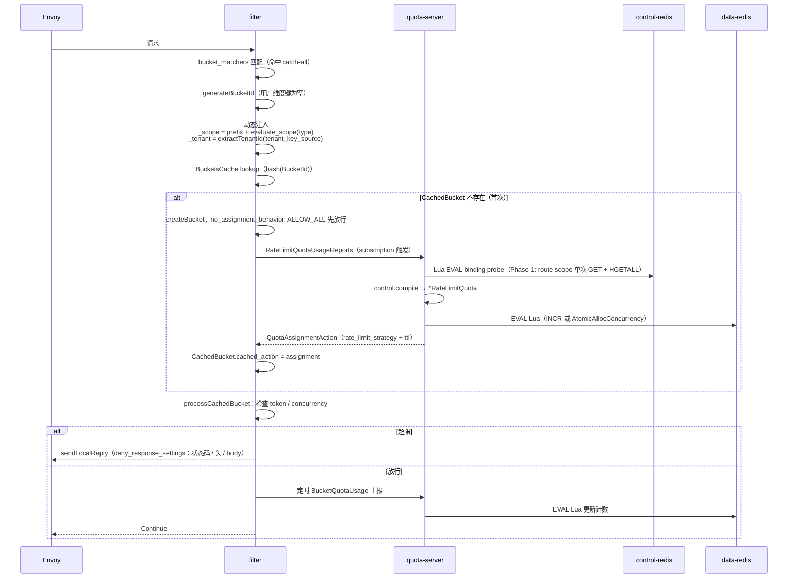

# T-EC-08 数据面限流多租隔离方案 — 技术规格

> **模块归属**: 数据面（Envoy 内核 + Envoy 插件 + ratelimit-quota-server）
> **代码仓库**: envoy（`source/extensions/filters/http/rate_limit_quota_apig/`）+ ratelimit-quota-server + istio（`pilot/pkg/config/alikube/quotarule/`）
> **权威文档路径**: `source/extensions/filters/http/rate_limit_quota_apig/docs/multi-tenant-design.md`
> **状态**: READY
> **Owner**: 南澈

---

## 一、架构总览

### 1.1 核心架构图

**整体控制流**：
1. 控制台下发租户粒度 `quotarule crd` 到 控制 Tair。
2. 控制台下发租户粒度下路由级 qps 限流/并发限流到 控制 Tair。
3. 控制面 Istio 监听 控制 Tair，生成对应的 Envoy 插件配置和 ratelimit-quota-server 组件的 CM 配置。

**整体数据流**：
1. Envoy rate-limit-quota-api 插件，提取请求匹配的路由信息和组合信息，访问 ratelimit-quota-server；ratelimit-quota-server 访问 控制 Tair 获取限流规则。
2. Envoy 通过限流规则，生成对应的 `bucket_id`，访问 ratelimit-quota-server（该组件同数据流 Tair 做交互），查看是否限流。

```text
┌───────────────┐
│    控制台     │
└───────┬───────┘
        │ 1. 下发租户粒度 quotarule crd
        │ 2. 下发路由级 qps/并发限流
        ▼
┌───────────────┐   3. 监听    ┌───────────────┐
│ 控制 Tair     │◄─────────────┤ 控制面 Istio  │
└───────┬───────┘              └───────┬───────┘
        │                              │ 生成 Envoy 插件配置
        │ 1. 获取限流规则               │ 和 server CM 配置
        │                              ▼
        │                      ┌───────────────┐
        │       1. 提取路由与   │  Envoy 插件   │
        │          组合信息访问 │(rate-limit-   │
        ▼       ┌──────────────┤ quota-api)    │
┌───────────────┐▼             └───────────────┘
│ratelimit-quota│  2. 通过限流规则生成 bucket_id
│    -server    │◄─── 访问并查看是否限流
└───────┬───────┘
        │ 2. 交互
        ▼
┌───────────────┐
│ 数据流 Tair   │
└───────────────┘
```

### 1.2 演进路线

| 阶段 | 交付内容 |
|---|---|
| **Phase 1** | filter `tenant_key_source` 动态注入 `_tenant`/`_scope`；server control 模块读 Tair（**Phase 1 默认仅探测 route 级 scope**，可通过 `CONTROL_SCOPE_ORDER` 或 ConfigMap 热加载扩展至多级）；server 实现 `StreamRlQsConfigs` 推送 BucketSettings（含 `deny_response_settings`） |

### 1.3 本期功能范围（Phase 1）

每条路由在以下两种模式中**二选一**，不按 header 等维度拆桶：

- **路由级单时间窗 QPS**（`quota_dimension: request`）
- **路由级并发上限**（`quota_dimension: concurrency`）
- **每路由可选** `denied_response`（HTTP 状态码 / 响应头 / 正文）

> **Phase 1 scope 限制**：server `DefaultScopeOrder` 默认为 `[route]`（仅探测路由级 binding），
> Lua EVAL 只执行 1 次 GET + 1 次 HGETALL（性能最优）。运维可通过环境变量
> `CONTROL_SCOPE_ORDER=route,global` 或 ConfigMap `control.scope_order` 热加载扩展到多级 scope，
> 无需重启。

---

## 二、关键设计决策

### D-1 `_tenant`/`_scope` 动态注入

`_scope`（路由名）和 `_tenant`（租户 ID）在 `filter.cc:decodeHeaders` 中从请求的运行时上下文读取，注入 BucketId。Pilot 无需感知路由名，也无需为每条路由生成单独的 BucketSettings。

#### 实现位置：`decodeHeaders`（`generateBucketId` 之后，hash 之前）

**tenant 提取**：按 `tenant_key_source.tenant.order` 依次尝试各来源（第一个非空值即返回）：

```cpp
// LISTENER_METADATA: 从 filter-chain metadata 中读取 apig_tenant.tenant_id
// FILTER_CHAIN_NAME: 从 filter chain name 中用正则提取捕获组

auto& bucket_map = *ret->mutable_bucket();
std::string tenant_id = extractTenantId(config_->tenantKeySource().tenant());
if (tenant_id.empty()) {
  tenant_id = "_unknown";  // 兜底值，统计 tenant_extract_unknown_ 计数
}
bucket_map["_tenant"] = tenant_id;
```

**scope 提取**：`evaluate_scope` lambda 根据 `ScopeConfig.type` 决定来源：

| ScopeType | 默认 prefix | 值来源 | 备注 |
|---|---|---|---|
| `ROUTE_NAME` (0) | `"route:"` | `route()->routeEntry()->routeName()` | **默认使用原始路由名**，设 `enable_route_name_hash=true` 对路由名做 MD5 哈希（32 位十六进制）。per-worker LRU 缓存（上限 4096 条） |
| `VIRTUAL_HOST_NAME` (1) | `"domain:"` | `headers.getHostValue()` | — |
| `CLUSTER_NAME` (2) | `"service:"` | `route()->routeEntry()->clusterName()` | — |
| `GLOBAL` (3) | `"global:"` | 硬编码 `"_"` | — |
| `REQUEST_HEADER` (4) | `"header:"` | `headers.get(header_name)` | — |

scope 注入顺序：先执行 `tenant_key_source.scope`（主 scope，默认写入 `_scope` 键），再依次执行 `additional_scopes`（每项可通过 `bucket_key` 指定不同 BucketId 键名）。

```cpp
// 主 scope
if (key_source.has_scope()) {
  evaluate_scope(key_source.scope());       // 写入 bucket_map["_scope"]
}
// 附加 scope（可选，bucket_key 可自定义）
for (const auto& s_cfg : key_source.additional_scopes()) {
  evaluate_scope(s_cfg);                    // 写入 bucket_map[s_cfg.bucket_key()]
}
```

#### `TenantKeySource` proto 定义（`RateLimitQuotaFilterConfig` 字段 106）

```proto
message TenantKeySource {
  message TenantConfig {
    enum SourceType {
      LISTENER_METADATA = 0;
      FILTER_CHAIN_NAME = 1;
    }
    repeated SourceType order = 1;
    string metadata_namespace  = 2;  // default: "apig_tenant"
    string metadata_field      = 3;  // default: "tenant_id"
    string chain_name_pattern  = 4;  // 正则，如 "^tenant-(.+)-fc$"
    uint32 capture_group       = 5;
  }
  message ScopeConfig {
    enum ScopeType {
      ROUTE_NAME        = 0;
      VIRTUAL_HOST_NAME = 1;
      CLUSTER_NAME      = 2;
      GLOBAL            = 3;
      REQUEST_HEADER    = 4;
    }
    ScopeType type             = 1;
    string    prefix           = 2;  // 各 type 有独立默认值（见上表）
    string    header_name      = 3;  // 仅 REQUEST_HEADER 使用
    string    bucket_key       = 4;  // 默认 "_scope"；additional_scopes 可自定义
    bool      enable_route_name_hash = 5;  // false=原始路由名（默认）；true=MD5 哈希
  }
  TenantConfig         tenant           = 1;
  ScopeConfig          scope            = 2;
  repeated ScopeConfig additional_scopes = 3;
}

// RateLimitQuotaFilterConfig 新增字段：
uint32             max_bucket_cache_entries = 105;  // 默认 50000，上限 10000000
TenantKeySource    tenant_key_source        = 106;
core.v3.GrpcService rlqs_config_server      = 107;  // Config DS 连接（与 rlqs_server 使用同一 cluster）
```

#### 约束

- `_tenant` / `_scope` 以下划线开头，为系统保留键，不在 `BucketIdBuilder` 中配置
- `tenant_key_source` 未配置时不注入 `_tenant`，兼容单租场景
- 未提取到 tenant 时兜底为 `"_unknown"`，并递增 `tenant_extract_unknown_` 统计计数器
- `rlqs_config_server` 配置后自动禁用 cold/hot split（server 推送 BucketSettings 使冷路径同步 RPC 冗余）

### D-2 `deny_response` 下发路径

由 quota-server 动态推送：server 在访问控制 Tair 获取 plugin-config 后，通过 `StreamRlQsConfigs`（`ConfigDiscoveryService`）将包含 `deny_response_settings` 的 `BucketSettings` 动态推送给 filter，控制台修改 Tair 后将直接生效。 filter 在 `processCachedBucket` 超限时调用 `sendDenyResponse` → `sendLocalReply`。

**plugin-config 字段与 Envoy proto 对应关系**：

| plugin-config（Tair）| Envoy `DenyResponseSettings` |
|---|---|
| `denied_response.status` | `http_status.code` |
| `denied_response.headers[]` | `response_headers_to_add[]`（最多 10 条）|
| `denied_response.body` | `http_body.value` |

### D-3 并发模型：Gauge 上报

filter 通过 `BucketQuotaUsage.active_requests` 上报当前实例的并发数（gauge），server 用 `AtomicAllocConcurrency` Lua 脚本维护全局计数：

```
HSET {key}:active_concurrency    <client_id>  reported_active  # 每实例 gauge
ZADD {key}:active_concurrency_ts <ts>         <client_id>      # 心跳，过期自动剔除
INCRBY {key}:active_concurrency_total  delta                   # 全局总数
→ 返回 (total_active, allocation, remaining)
```

网络抖动或 Envoy 进程崩溃时，ZSET 心跳 TTL 到期后自动清理失效实例，无需 per-request lease。

### D-4 quota-server 与 Redis 的交互

quota-server 是系统中唯一连接两个 Redis 实例的组件，两者职责严格分离。

#### D-4.1 control 模块 → Tair（control-redis）只读

每次 RLQS 收到新 BucketId 时，control 模块通过**单次 Lua EVAL**（`EVALSHA` + `NOSCRIPT` 回退 `EVAL`）执行 binding 探测：

```lua
-- binding-probe Lua 脚本（lua.go）
-- KEYS[1..N] = binding key（按 ScopeOrder 优先级排列）
-- ARGV[1..N] = 对应的 plugin-config key
local n = #KEYS
for i = 1, n do
  local v = redis.call('GET', KEYS[i])
  if v and v ~= false then
    return redis.call('HGETALL', ARGV[i])  -- 第一个命中即返回
  end
end
return {}  -- 全部未命中 → AbandonAction
```

**Phase 1 默认行为**：`ScopeOrder = [route]`，Lua 脚本仅传入 1 个 KEYS + 1 个 ARGV，执行 1 次 GET + 1 次 HGETALL（命中时），性能最优。

> 后续阶段可扩展为多级 scope 探测（如 `route,global`），通过 `CONTROL_SCOPE_ORDER` 环境变量或 ConfigMap `control.scope_order` 热加载生效，无需重启。Lua 脚本按 scope 优先级顺序探测，第一个命中即短路返回。

**key 模板**（默认值，双花括号 `{{tenant}}` 形成 Redis hash-tag `{tenant}` 确保集群模式下同租户的所有 binding key 落在同一 slot，避免 `CROSSSLOT` 错误）：

```
binding key: console:plugin-binding:{{tenant}}:{scope_type}:{scope_value}
config key:  console:plugin-config:{{tenant}}:{scope_type}:{scope_value}:rate-limit-quota-apig
```

**scope 过滤**：`candidates()` 函数按 `ScopeOrder` 过滤调用方提供的 scope 值。数据面调用方（`scopeValuesFromBucket`、`parseResourceName`）始终注入 `ScopeGlobal: "_"`，但当 `global` 不在 `ScopeOrder` 中时被 `candidates()` 安全丢弃。

结果经 LRU cache（TTL 10s + jitter 0.15 + refresh-ahead 10s）缓存；Tair 抖动时 stale 继续使用；无配置时返回 AbandonAction。

#### D-4.2 quota 模块 → data-redis 读写

从 BucketId 提取 `_tenant`、`_scope` 拼接计数 key：

```
# QPS：INCR + TTL（Lua 原子）
ratelimit-quota:counter:{_tenant}:{scope_type}:{scope_value}:{bucket_name}:_:SECOND:{window_slot}

# 并发：三键族，同一 hash-tag（AtomicAllocConcurrency Lua）
{ratelimit-quota:concurrency:{_tenant}:{scope_type}:{scope_value}:{bucket_name}}:active_concurrency
{ratelimit-quota:concurrency:{_tenant}:{scope_type}:{scope_value}:{bucket_name}}:active_concurrency_total
{ratelimit-quota:concurrency:{_tenant}:{scope_type}:{scope_value}:{bucket_name}}:active_concurrency_ts
```

- **QPS**：`allocateQuotaForBucketSingleKey` → `EVAL` Lua，`INCR` 当前时间槽计数，超限时返回 deny token 数
- **并发**：`AtomicAllocConcurrency` → `EVAL` Lua，`HSET` 当前值、`ZADD` 心跳 TTL、`INCRBY` 总量；ZSET 到期项自动清理失效实例

`{scope_type}:{scope_value}` 由 `_scope` 拆分（如 `route:chat-api`）。`scopeValuesFromBucket` 解析逻辑：若 `_scope` 含冒号则按 `type:value` 拆分；否则整个值视为 route name。

### D-5 ConfigMap schema

```yaml
redis_info:
  redis_url:  "data-redis.istio-system:6379"
  redis_auth: "${DATA_REDIS_AUTH}"

control_redis_info:
  redis_url:  "tair-control.istio-system:6379"
  redis_auth: "${CONTROL_TAIR_AUTH}"

# control 配置独立于 control_redis_info（连接信息），由 server 解析
# 所有字段可选，缺失时取 server 内置默认值
control:
  scope_order:          "route"                    # Phase 1 默认仅 route
  binding_key_template: "console:plugin-binding:{{tenant}}:{scope_type}:{scope_value}"
  config_key_template:  "console:plugin-config:{{tenant}}:{scope_type}:{scope_value}:rate-limit-quota-apig"
  cache:
    ttl:          10s
    negative_ttl: 10s
    jitter:       0.15
    refresh_ahead: 10s
    max_entries:  500000
  fetch:
    pipeline_max_keys: 16
    timeout:           50ms
    on_failure:        "ALLOW"
    on_failure_use_stale: true
```

`redis_info` / `control_redis_info` 为连接信息；`control` 为 Phase 1 扩展的查询行为配置。ConfigMap 变更后通过 `ConfigWatcher`（30s 轮询）热加载，`control.Lookup.Reload()` 原子更新配置，无需重启。

### D-6 AbandonAction 语义

server 在以下情况下发 AbandonAction：

1. BucketId 对应的 (`tenant`, `scope`) 在 Tair 无配置——filter 收到后走 `no_assignment_behavior` 兜底

filter 侧对该情况的处理逻辑为 remove + re-subscribe on next request。

### D-7 plugin-config → 内部策略映射

server control 模块将 Tair 中的 plugin-config 编译为 `config.RateLimitQuota`：

| plugin-config 字段 | `RateLimitStrategyConfig` 字段 | 走哪条路径 |
|---|---|---|
| `quota_dimension: "request"` | `QuotaDimension = QuotaDimensionRequest` | `allocateQuotaForBucketSingleKey` |
| `requests_per_unit: 100` | `RequestsPerUnit = 100` | |
| `unit: "SECOND"` | `Unit = "SECOND"` | |
| `quota_dimension: "concurrency"` | `QuotaDimension = QuotaDimensionConcurrency` | `AtomicAllocConcurrency` |
| `max_concurrent: 50` | `RequestsPerUnit = 50` | |
| `lease_ttl: "5m"` | concurrency expiration seconds | |

control 模块输出 `*RateLimitQuota`，作为 `constructLimitsToCheck` 前的 lookup 结果接入现有 quota 模块，quota 模块本身无需改动。

### D-8 `StreamRlQsConfigs` 接口

`RateLimitQuotaConfigDiscoveryService`（`ConfigDsService`）已完整实现，提供三个 RPC：
- `StreamRlQsConfigs`（双向流）：filter 订阅 resource name（格式 `{tenant}|{scope_type}:{scope_value}`），server 推送 `BucketSettings`
- `FetchRlQsConfigs`（单次拉取）
- `GetQuotaConfig`（单租户+scope 查询）

实现细节：
- 每个连接创建 `streamSubscriber`，带有界推送通道（默认 256 条）
- Recv 协程接收 `DiscoveryRequest`，累积 resource names
- 主循环 select 处理：请求到达 → `buildResponse()` 构建并发送；Pub/Sub 失效事件 → 推送预构建的 `DiscoveryResponse`
- Tair Pub/Sub 失效：控制台写入 plugin-config 后发布到 `console:plugin-config-invalidate:{tenant}:{scope_type}:{scope_value}`，server 监听后通过 `onInvalidation` 回调驱动推送
- panic 恢复：Recv 协程和失效回调中的 panic 被 recover，递增 `PanicRecovery` 计数器
- 指标：stream 创建/关闭、推送丢弃、构建错误、AbandonAction 发送等均有独立统计计数器

---

## 三、组件职责矩阵

| 组件 | 职责 | 连 Tair? | 连 data-redis? | 连 quota-server? |
|---|---|---|---|---|
| QuotaRule CRD | 描述基础设施 | — | — | — |
| Pilot quotarule.go | 翻译 QuotaRule → global EnvoyFilter + ConfigMap | -- | -- | -- |
| **Console** | plugin-binding / plugin-config / `denied_response` 写入方 | 写 | -- | -- |
| Gateway operator | listener / filter-chain metadata 注入 | -- | -- | -- |
| Envoy + filter | bucket_matchers 匹配；动态注入 `_tenant`/`_scope`；RLQS 上报；sendLocalReply | -- | -- | 是（rlqs_server + rlqs_config_server） |
| **ratelimit-quota-server** | 双 Redis 唯一客户端；control 模块 Tair Lua EVAL 查询；quota 计算；ConfigDS 推送 | 读 | 读写 | （服务端） |

---

## 四、数据结构（关键契约）

### 4.1 control-redis 上的 plugin-binding（Console 写）

```bash
EXSET console:plugin-binding:t001:route:chat-api '{
  "version": 13,
  "plugins": [
    {"name": "key-auth",              "priority": 1205},
    {"name": "rate-limit-quota-apig", "priority": 140},
    {"name": "ai-proxy",              "priority": 500}
  ]
}'
```

### 4.2 control-redis 上的 plugin-config（Console 写、quota-server 读）

字段约定：扁平、单配额；`denied_response` 可选（由 server 通过 ConfigDS 动态推送给 filter）。

#### 4.2.1 路由级单窗口 QPS

```json
EXSET console:plugin-config:t001:route:chat-api:rate-limit-quota-apig '{
  "version": 7,
  "config": {
    "quota_dimension": "request",
    "requests_per_unit": 100,
    "unit": "SECOND",
    "denied_response": {
      "status": 429,
      "headers": [
        { "name": "content-type",      "value": "application/json; charset=utf-8" },
        { "name": "x-ratelimit-reason","value": "route-qps" }
      ],
      "body": "{\"code\":\"RATE_LIMITED\",\"route\":\"chat-api\"}"
    }
  }
}'
```

#### 4.2.2 路由级并发上限

```json
EXSET console:plugin-config:t001:route:chat-api:rate-limit-quota-apig '{
  "version": 3,
  "config": {
    "quota_dimension": "concurrency",
    "max_concurrent": 50,
    "lease_ttl": "5m",
    "denied_response": {
      "status": 503,
      "headers": [
        { "name": "content-type", "value": "application/json; charset=utf-8" }
      ],
      "body": "{\"code\":\"CONCURRENCY_LIMIT\",\"route\":\"chat-api\"}"
    }
  }
}'
```

### 4.3 QuotaRule CR（Pilot 输入）

```yaml
# 基础设施 QuotaRule（整网关一份）
apiVersion: networking.istio.io/v1alpha3
kind: QuotaRule
metadata:
  name: apig-global-rl
spec:
  redis_info:
    redis_url: "data-redis.istio-system:6379"
    redis_auth: "..."
  control_redis_info:
    redis_url: "tair-control.istio-system:6379"
    redis_auth: "..."
  tenant_key_source:
    tenant:
      order: [LISTENER_METADATA]
      metadata_namespace: "apig_tenant"
      metadata_field: "tenant_id"
    scope:
      type: ROUTE_NAME
      prefix: "route:"
      # enable_route_name_hash: true  # 可选：对路由名做 MD5 哈希
```

---

## 五、代码改动清单

### 5.1 quota-server（工作量 M）

- **`control/lookup.go`**：`DefaultScopeOrder = [ScopeRoute]`（Phase 1 route-only），`candidates()` 按 ScopeOrder 过滤 scope，`applyDefaults()` 填充默认值。`Reload()` 支持原子热更新配置。
- **`control/lua.go`**：binding-probe Lua 脚本，KEYS[1..N] GET + 首命中 HGETALL ARGV[i]。
- **`service/rlqs_config_ds.go`**：`ConfigDsService` 完整实现 `StreamRlQsConfigs`，支持 Pub/Sub 失效推送、panic 恢复、指标采集。
- **`service/ratelimit_quota.go`**：`scopeValuesFromBucket()` 解析 BucketId 中的 `_scope`（`type:value` 格式）和 `_tenant`，始终注入 `ScopeGlobal: "_"` 兜底。
- **`settings/settings.go`**：`RedisConfig` 结构支持 `control` 嵌套配置（`ControlConfig` / `ControlCacheConfig` / `ControlFetchConfig`）。`CONTROL_SCOPE_ORDER` 环境变量默认为 `"route"`。

control 模块返回 `*RateLimitQuota`，quota 模块全期无改动——所有扩展通过 BucketId 键增减和 key prefix 拼接完成。

### 5.2 istio quotarule（工作量 M）

- **`quotarule.go`**：`convertTenantKeySource()`、`extractRedisInfos()`、`findTenantKeySource()` 新增函数。`Conversion()` 三层路由：TKS QR → 提取 redis 信息；hasTenantKeySource → 跳过路由补丁；否则 → 普通路由补丁。`BuildHTTPFilter()` 新增 `tenantKeySource` 参数，配置 `rlqs_config_server` 和 `max_bucket_cache_entries`。
- **`model.go`**：`RateLimitConfig` 新增 `ControlRedisInfo *RedisInfo`。
- **`quotarule.yaml`**（CRD）：新增 `controlRedisInfo`、`tenantKeySource`、`scope` 字段的 OpenAPI 校验。

### 5.3 filter C++（工作量 M）

**proto**：`rate_limit_quota.proto` 中 `RateLimitQuotaFilterConfig` 新增 `max_bucket_cache_entries` (105)、`tenant_key_source` (106)、`rlqs_config_server` (107)。`TenantKeySource` 消息含 `TenantConfig`、`ScopeConfig`（5 种 ScopeType）、`additional_scopes`（见 D-1 完整定义）。

**`filter.cc`**：`decodeHeaders` 中 `generateBucketId` 之后、`hash` 之前，`evaluate_scope` lambda 按 ScopeType 提取值（ROUTE_NAME 默认 MD5 哈希，per-worker LRU 缓存），`extractTenantId` 按 order 尝试 LISTENER_METADATA / FILTER_CHAIN_NAME。未提取到 tenant 时兜底 `"_unknown"`。

其余函数（`matcher.cc:generateBucketId`、`sendDenyResponse`、`processCachedBucket`、上报逻辑）无需修改。

---

## 六、关键路径

### 6.1 部署期

```
1) 运维 apply 基础设施 QuotaRule（redis_info + control_redis_info + tenant_key_source）
2) Pilot 生成：
   ├─ global EnvoyFilter（HCM + tenant_key_source + catch-all BucketSettings）→ xDS push
   └─ ConfigMap（redis_info + control_redis_info + control 扩展字段）→ quota-server watch
3) Envoy 启动，filter 加载 tenant_key_source 配置和 bucket_matchers
4) quota-server 启动，连接两个 Redis，control 模块建立 Tair 连接，ConfigDS 注册
```

### 6.2 业务接入期

```
1) Console 写 Tair：plugin-binding + plugin-config（quota_dimension / limits / denied_response）
2) Gateway operator 配置 listener，filter-chain metadata 注入 apig_tenant.tenant_id
```

### 6.3 单请求



### 6.4 配置变更

```
# limit 变更（无需 Pilot 参与，Console 直接写 Tair）
Console EXSET console:plugin-config:{t}:{scope}:rate-limit-quota-apig
  → quota-server cache TTL / refresh_ahead 到期 → Lua EVAL 重新探测 Tair → 新 QuotaAssignmentAction
  → filter assignment_time_to_live 到期后生效（最差 cache.ttl 秒）

# Pub/Sub 实时失效（可选，加速生效）
Console PUBLISH console:plugin-config-invalidate:{t}:{scope_type}:{scope_value}
  → server onInvalidation → LRU cache evict → ConfigDS pushCh → filter 立即收到新 BucketSettings
```

---

## 七、降级与异常

| 场景 | 处理 |
|---|---|
| quota-server 不可达 | `no_assignment_behavior: ALLOW_ALL` 兜底；server 多副本 + Envoy upstream 健康检查 |
| control-redis（Tair）抖动 | stale cache 继续使用；`on_failure: ALLOW` 放行；`FetchTimeout`（默认 50ms）超时后退化为 stale 缓存 |
| data-redis 抖动 | server 本地内存计数兜底（degradation 路径），DataRedisHealthProbe 检测并驱动 HealthChecker |
| BucketId 无 Tair 配置 | 发 AbandonAction → filter `no_assignment_behavior: ALLOW_ALL` 兜底 |
| 同 (tenant, route) 大量首次请求 | control 模块 singleflight 合并 Tair 查询；filter `createBucket` 幂等 |
| 并发 Envoy 实例心跳超时 | ZSET TTL 到期自动清理失效实例，`AtomicAllocConcurrency` 重算总数 |
| tenant 提取失败 | 兜底为 `"_unknown"`，递增 `tenant_extract_unknown_` 计数器 |
| ConfigDS 推送通道满 | 丢弃消息，递增 `PushDropped` 计数器，下次 refresh-ahead 或客户端重连时自愈 |

---

## 八、设计不变量

1. **filter 零 Redis 依赖**：filter 配置内不出现 Redis 集群名 / key 模板。
2. **filter 唯一对外连接是 quota-server**：通过 `rate_limit_quota_service` cluster（同时用于 RLQS 和 ConfigDS）。
3. **quota-server 是双 Redis 唯一客户端**：Tair 与 data-redis 均只由 server 访问。
4. **`_tenant` / `_scope` 由 filter 运行时注入**：值来自请求上下文（filter-chain metadata、路由名），不在 `BucketIdBuilder` 配置中出现。
5. **Pilot 不连任何 Redis**，不参与计数决策。
6. **Console 是 Tair plugin-config 唯一写入方**。
7. **limit 策略走 Tair 动态**，路由级整体配置从 Tair 获取。
8. **quota 模块（Lua / `quota_key.go` / `alloc_single_bucket.go` / `AtomicAllocConcurrency`）全期不改**：所有扩展通过 BucketId 键增减和 key prefix 拼接完成。
9. **Phase 1 默认 route-only scope**：`DefaultScopeOrder = [route]`，运维可通过 `CONTROL_SCOPE_ORDER` 或 ConfigMap `control.scope_order` 热加载扩展，`Lookup.Reload()` 原子生效。

---

## 九、验收线

- 单 (tenant, route) cache 命中 P99 <= 1ms（filter `processCachedBucket` 本地判断）
- 单 (tenant, route) 首次回源 P99 <= 8ms（server Lua EVAL binding probe + 编译）
- Tair 抖动期间 filter <-> server quota 链路不受影响；stale fallback 生效
- data-redis 抖动期间 server `FAIL_OPEN`，filter 侧无报错
- 路由配置 `denied_response` 后：拒绝响应 HTTP 状态码 / 至少一个 header / body 与配置一致
- 并发超限时：server `AtomicAllocConcurrency` 返回 total_active > max_concurrent → deny
- Console 修改 plugin-config limit → 最长 `cache.ttl`（10s）+ `assignment_time_to_live` 内 server 读到新值，filter 生效
- Pub/Sub 失效通道正常时，配置变更 <= 1s 生效

---

## 十、待决策事项

- [ ] **data-redis 购买规格评估**（owner: 南澈，截止 2026-05-15）：路由级单计数空间下的 QPS / Key 数量 / 内存模型
- [ ] **控制台 文昀 待介入**（T-C-29）：`quota_dimension` / `requests_per_unit` / `unit` / `max_concurrent` / `lease_ttl` / `denied_response` 的表单、校验与文案；整体联调 2026-05-22

---

## 十一、变更记录

- 2026-05-13 初稿
- 2026-06-02 根据最新实现更新：
  - D-1：补全 `ScopeType` 枚举（5 种）、`additional_scopes`、`bucket_key`、`enable_route_name_hash`、`rlqs_config_server`(107)、`max_bucket_cache_entries`(105)；补充 MD5 哈希行为、`_unknown` 兜底、evaluate_scope lambda 逻辑
  - D-4.1：修正 "6-scope MGET" 为 "Lua EVAL binding probe"，Phase 1 默认 route-only 单次探测
  - D-5：ConfigMap schema 修正 `control` 嵌套结构（`cache`/`fetch` 子节点），反映实际 `settings.RedisConfig` 结构
  - D-8：标注 `ConfigDsService` 已完整实现，补充 Pub/Sub 失效推送、panic 恢复、指标采集细节
  - 新增设计不变量 #9（Phase 1 route-only scope）
  - 6.3 时序图更新为 Lua EVAL probe
  - 6.4 补充 Pub/Sub 实时失效路径
  - 七 降级与异常：补充 FetchTimeout、tenant 提取失败、ConfigDS 推送通道满场景
